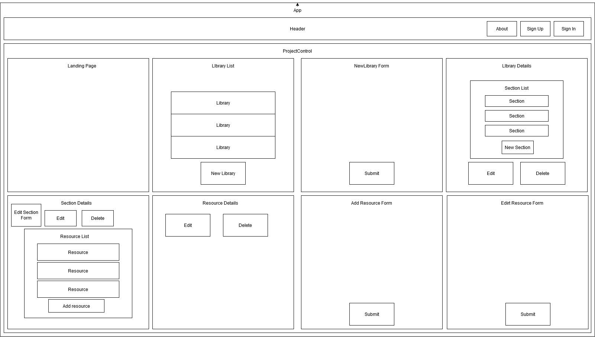

# _Resourcey_
#### _Capstone project for Epicodus, Initialized: 2020.09.25, Last Updated: 2020.10.07_
#### By _**Sara Kane**_

## Description
The goal of Resourcey is to provide a space for users to store and share online resources they have found helpful for learning a topic and share those resources with others.

Users are able to create a resource library for a specific topic or a class (examples: History 101 or Introduction to Programming) and add links to resources such as documentation, tutorials, online videos, or additional courses they have found helpful related to that topic or class.

## MVP
See [here](/Proposal.md) for capstone proposal.<br />
<table>
  <tr style="text-align: left">
    <th> </th>
    <th>Feature</th>
  </tr>
  <tr>
    <td>✔</td>
    <td>Users are able to create a resource library, add sections to that library, and add a resource to that section with full CRUD functionality</td>
  </tr>
  <tr>
    <td></td>
    <td>User registration (database storage)</td>
  </tr>
  <tr>
    <td></td>
    <td>User login/logout (database authentication)</td>
  </tr>
  <tr>
    <td></td>
    <td>Registered users can view another user’s resource library</td>
  </tr>
  <tr>
    <td></td>
    <td>Registered users can add a resource to another user’s resource library</td>
  </tr>
  <tr>
    <td></td>
    <td>Registered users can edit or delete resources they’ve added</td>
  </tr>
</table>

<br/>

## Stretch Goals

<table>
  <tr style="text-align: left">
    <th></th>
    <th>Feature</th>
  </tr>
  <tr>
    <td></td>
    <td>Private resource libraries</td>
  </tr>
  <tr>
    <td></td>
    <td>Resource libraries that are shared with only authorized users</td>
  </tr>
  <tr>
    <td></td>
    <td>Resource libraries can have additional admins that have full CRUD functionality for library sections and resources</td>
  </tr>
  <tr>
    <td></td>
    <td>Users can upvote resources they’ve found helpful</td>
  </tr>
  <tr>
    <td></td>
    <td>Users can upvote resources they’ve found helpful</td>
  </tr>
  <tr>
    <td></td>
    <td>Website is hosted</td>
  </tr>
</table>

<br />

### 🎨 Mockups & Diagrams
<details>
  <summary>Diagrams</summary>
  
</details>

## ⚙ Setup/Intstallation
### Required software:
* [NodeJs](https://nodejs.org/en/) is required to run the project 

### Download Repo
* Clone this GitHub repository by running `git clone https://github.com/sarakane/capstone.git` in the terminal.
  * Or download the ZIP file by clicking on `Code` then `Download ZIP` from this repository.

### Setup locally
* Navigate into the new `capstone` directory
* Once inside the `capstone` directory run `npm install` to install all of the necessary dependencies.

### Setup Database
* Create a [Firebase](https://firebase.google.com) account and setup a Firebase project and Firestore database within that project for this application.
* Add a .env file to the `capstone` directory and enter your Firestore information

Example:
```
REACT_APP_FIREBASE_API_KEY="YOUR_API_KEY"
REACT_APP_FIREBASE_AUTH_DOMAIN="YOUR_AUTH_DOMAIN"
REACT_APP_FIREBASE_DATABASE_URL="YOUR_DATABASE_URL"
REACT_APP_FIREBASE_PROJECT_ID="YOUR_PROJECT_ID"
REACT_APP_FIREBASE_STORAGE_BUCKET="YOUR_STORAGE_BUCKET"
REACT_APP_FIREBASE_MESSAGING_SENDER_ID="YOUR_MESSAGING_SENDER_ID"
REACT_APP_FIREBASE_APP_ID="YOUR_APP_ID"
```

### 🏃‍♀️ Available Scripts
<details>
  <summary>In the project directory, you can run:</summary>

### `npm start`
Runs the app in the development mode.<br />
Open [http://localhost:3000](http://localhost:3000) to view it in the browser.

### `npm test`
*Currently there are no tests*<br />
Launches the test runner in the interactive watch mode.<br />

### `npm run build`
Builds the app for production to the `build` folder.<br />
</details>

## 🐛 Known Bugs
No known bugs.

## Support
Found a bug or want to add a feature? [Open a new issue here](https://github.com/sarakane/capstone/issues/new).

## 📓 Work Log
<details>
  <summary>Log of time spent on project not actively coding</summary>
<h4>2020.09.25</h4>
<table>
 <tr>
  <th>Work</th>
  <th>Time Spent</th>
 </tr>
 <tr>
  <td>Clean up project created by create-react-app</td>
  <td>8:29 a.m. -8:39 a.m.</td>
 </tr>
 <tr>
  <td>Make README outline</td>
  <td>8:39 a.m.-9:14 a.m.</td>
 </tr>
 <tr>
  <td>Add proposal to project</td>
  <td>9:14 a.m.-9:37 a.m.</td>
 </tr>
 <tr>
  <td>Work on website mockup</td>
  <td>9:37 a.m.-12:08 p.m.</td>
 </tr>
  <tr>
  <td>Continue to work on website mockup</td>
  <td>1:08 p.m.-2:06 p.m.</td>
 </tr>
 <tr>
  <td>Research potential tools to use for hosting, database, deciding if I need to make an api if I want the possibility of making a mobile version</td>
  <td>2:06-3:52</td>
 </tr>
  <tr>
  <td>Update README</td>
  <td>3:52-4:11</td>
 </tr>
  </tr>
  <tr>
  <td>Continue working on wireframe/component diagram</td>
  <td>4:11-5:00</td>
 </tr>
</table>
<h4>2020.10.02</h4>
<table>
  <tr>
  <th>Work</th>
  <th>Time Spent</th>
  </tr>
  <tr>
    <td>8:00 a.m. - 8:30 a.m.</td>
    <td>Asses today's work</td>
 </tr>
 <tr>
    <td>8:30 a.m. - 10:45am</td>
    <td>Look into tutorials for creating a full stack app with React</td>
 </tr>
 <tr>
    <td>10:45 a.m. - 12:00pm</td>
    <td>Read documentation on GraphQL</td>
 </tr>
  <tr>
    <td>1:00 p.m. - 1:30pm</td>
    <td>Set up firestore database</td>
 </tr>
</table>
</details>

## 💻 Technologies Used
* [React](https://reactjs.org/)
* [Redux](https://redux.js.org/)
* [Firestore](https://firebase.google.com/)
* [Materialize CSS](https://materializecss.com/)
* HTML
* JavaScript
* [VS Code](https://code.visualstudio.com/)
* [Git](https://git-scm.com/)


## 🔑 License
*This site is licensed under the MIT license.*

Copyright (c) 2020 **_Sara Kane_**


